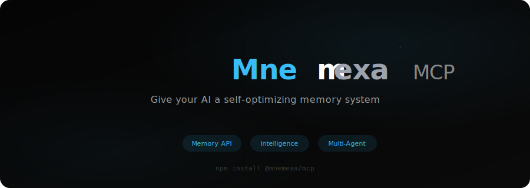
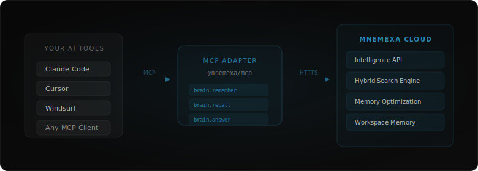
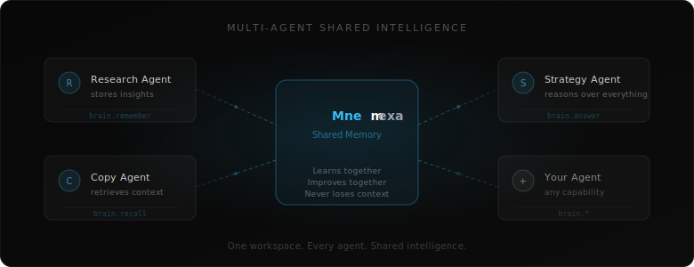

<div align="center">

<br/>

<picture>
  <source media="(prefers-color-scheme: dark)" srcset="assets/banner.svg">
  <source media="(prefers-color-scheme: light)" srcset="assets/banner.svg">
  
</picture>

<br/>

<p>
  <strong>The intelligence layer for AI that never forgets.</strong>
</p>

<p>
  <a href="https://www.npmjs.com/package/@bizxengine/mcp"></a>
  &nbsp;
  <a href="https://opensource.org/licenses/ISC"></a>
  &nbsp;
  
  &nbsp;
  
</p>

<p>
  <a href="https://app.bizxengine.com">Dashboard</a>&nbsp;&nbsp;&bull;&nbsp;&nbsp;<a href="https://bizxengine.com">Website</a>&nbsp;&nbsp;&bull;&nbsp;&nbsp;<a href="https://www.npmjs.com/package/@bizxengine/mcp">npm</a>
</p>

<br/>

</div>

---

<br/>

<h2>The Problem</h2>

Every time you start a new conversation with your AI:

- It forgets who you are
- It forgets your project context
- It forgets decisions you already made
- It asks the same questions again
- Your team's agents can't share knowledge

<br/>

> **Your AI has amnesia. BizXEngine gives it a brain.**

<br/>

---

<br/>

<h2>Install</h2>

```bash
npx @bizxengine/mcp
```

BizXEngine guides you through setup:

1. **Connect** your workspace
2. **Add** your API key
3. **Start** using memory instantly

<details>
<summary><strong>Advanced</strong> — power users</summary>

<br/>

```bash
npx @bizxengine/mcp --install YOUR_API_KEY
```

Pass your API key directly to skip the interactive setup.

</details>

<br/>

---

<br/>

<h2>Try It in 10 Seconds</h2>

Once installed, open your AI and try this:

```
> What is your status?
```

```
> Remember that this client prefers LinkedIn over Instagram.
```

```
> What do we know about this client?
```

That's it. Your AI now has persistent, self-optimizing memory.

<br/>

---

<br/>

<h2>Architecture</h2>

<br/>

<div align="center">
  <picture>
    <source media="(prefers-color-scheme: dark)" srcset="assets/architecture.svg">
    <source media="(prefers-color-scheme: light)" srcset="assets/architecture.svg">
    
  </picture>
</div>

<br/>

The adapter is a thin bridge — **all intelligence lives in BizXEngine's cloud.** Your AI calls memory tools automatically, no manual work needed.

<br/>

---

<br/>

<h2>Tools</h2>

Your AI gets these capabilities out of the box:

| Tool | What it does |
|:-----|:-------------|
| `brain.remember` | Save important information — preferences, decisions, context |
| `brain.recall` | Search memory before answering questions |
| `brain.answer` | Reason across multiple memories to synthesize answers |
| `brain.health` | Check memory quality, health score, and optimization insights |
| `brain.status` | Verify BizXEngine is connected and running |

<br/>

---

<br/>

<h2>Multi-Agent Memory</h2>

<p><em>Give your entire AI team a shared brain.</em></p>

<br/>

<div align="center">
  <picture>
    <source media="(prefers-color-scheme: dark)" srcset="assets/multi-agent.svg">
    <source media="(prefers-color-scheme: light)" srcset="assets/multi-agent.svg">
    
  </picture>
</div>

<br/>

Same API key = same workspace = **shared intelligence.**

```bash
# Agent 1 — your machine
npx @bizxengine/mcp --install bx_workspace_key

# Agent 2 — teammate's machine
npx @bizxengine/mcp --install bx_workspace_key

# Agent 3 — CI / automation
npx @bizxengine/mcp --install bx_workspace_key
```

Spin up a new agent, give it the workspace key, and it **instantly** has access to everything the team has learned.

<br/>

---

<br/>

<h2>Why BizXEngine?</h2>

<table>
  <tr>
    <th align="left">Feature</th>
    <th align="center">Basic Memory Tools</th>
    <th align="center">BizXEngine</th>
  </tr>
  <tr>
    <td>Store &amp; retrieve memory</td>
    <td align="center">Yes</td>
    <td align="center"><strong>Yes</strong></td>
  </tr>
  <tr>
    <td>Reason over memory</td>
    <td align="center">-</td>
    <td align="center"><strong>Yes</strong></td>
  </tr>
  <tr>
    <td>Shared team memory</td>
    <td align="center">-</td>
    <td align="center"><strong>Yes</strong></td>
  </tr>
  <tr>
    <td>Memory health insights</td>
    <td align="center">-</td>
    <td align="center"><strong>Yes</strong></td>
  </tr>
  <tr>
    <td>Self-optimizing system</td>
    <td align="center">-</td>
    <td align="center"><strong>Yes</strong></td>
  </tr>
  <tr>
    <td>Auto-categorization</td>
    <td align="center">-</td>
    <td align="center"><strong>Yes</strong></td>
  </tr>
  <tr>
    <td>Importance scoring</td>
    <td align="center">-</td>
    <td align="center"><strong>Yes</strong></td>
  </tr>
  <tr>
    <td>Temporal awareness</td>
    <td align="center">-</td>
    <td align="center"><strong>Yes</strong></td>
  </tr>
</table>

<br/>

BizXEngine isn't a key-value store. It's an **intelligence layer** that learns what matters, forgets what doesn't, and gets smarter over time.

<br/>

---

<br/>

<h2>Use Cases</h2>

<table>
<tr>
<td width="50%">

**Personal AI Memory**

> *"Remember that I prefer TypeScript and always use Tailwind."*

Next conversation, your AI already knows.

</td>
<td width="50%">

**Project Context**

> *"We decided PostgreSQL over MongoDB for billing."*

Weeks later, your AI recalls the decision and why.

</td>
</tr>
<tr>
<td width="50%">

**Client Work**

> *"This client prefers formal communication, timezone EST."*

Every agent remembers this for every future interaction.

</td>
<td width="50%">

**Agent Onboarding**

Spin up a new agent with the workspace key — it instantly knows everything the team has learned.

</td>
</tr>
</table>

<br/>

---

<br/>

<h2>What Gets Installed</h2>

The installer automatically configures everything:

| Step | What happens |
|:-----|:-------------|
| **1** | Saves your API key to `~/.bizxengine/config.json` |
| **2** | Adds BizXEngine MCP server to your AI tool's config |
| **3** | Injects memory instructions so your AI uses memory proactively |

<br/>

**Auto-detected AI tools:**

<p>
  
  &nbsp;
  
  &nbsp;
  
  &nbsp;
  
  &nbsp;
  
</p>

<br/>

---

<br/>

<h2>How Memory Works</h2>

BizXEngine is a self-optimizing intelligence system:

- **Auto-categorization** — memories are tagged and classified automatically
- **Importance scoring** — the system knows what matters and what doesn't
- **Hybrid search** — combines semantic similarity, recency, importance, and frequency
- **Deduplication** — won't store the same thing twice
- **Temporal awareness** — understands time-sensitive vs permanent information
- **Stale detection** — identifies outdated memories for cleanup
- **Reasoning** — synthesizes answers across your entire memory space

> Your AI doesn't just store text. **It builds understanding.**

<br/>

---

<br/>

<h2>Manual Configuration</h2>

<details>
<summary>Configure without the installer</summary>

<br/>

Add to your AI tool's MCP config:

```json
{
  "mcpServers": {
    "bizxengine": {
      "command": "npx",
      "args": ["-y", "@bizxengine/mcp"]
    }
  }
}
```

Set the API key via environment variable:

```bash
export BIZX_API_KEY=your_key_here
```

Or save it to `~/.bizxengine/config.json`:

```json
{
  "apiKey": "bx_your_key_here"
}
```

</details>

<br/>

---

<br/>

<h2>Security</h2>

| | |
|:--|:--|
| **API keys** | Stored locally in `~/.bizxengine/config.json` — never logged or exposed |
| **Transport** | All API calls use HTTPS only — enforced at startup |
| **Isolation** | The adapter never connects to any database directly |
| **Error handling** | Internal errors are never exposed to the AI or user |
| **Retries** | Only on transient failures (502/503/504) |
| **Data** | No data leaves your machine except to BizXEngine's API |

<br/>

---

<br/>

<h2>Environment Variables</h2>

| Variable | Required | Description |
|:---------|:---------|:------------|
| `BIZX_API_KEY` | No* | Your workspace API key. *Auto-loaded from config if installed via CLI. |
| `BIZX_BASE_URL` | No | API URL override (development only) |

<br/>

---

<br/>

<h2>Built With</h2>

<p>
  
  &nbsp;
  
  &nbsp;
  
  &nbsp;
  
</p>

<br/>

---

<br/>

<div align="center">

<br/>

<strong>Stop teaching your AI the same things twice.</strong>

<br/><br/>

<a href="https://app.bizxengine.com">
  
</a>

<br/><br/>

<p>
  <a href="https://app.bizxengine.com">Dashboard</a>&nbsp;&nbsp;&bull;&nbsp;&nbsp;<a href="https://bizxengine.com">Website</a>&nbsp;&nbsp;&bull;&nbsp;&nbsp;<a href="https://www.npmjs.com/package/@bizxengine/mcp">npm</a>
</p>

<sub>Built by <a href="https://bizxengine.com">BizXEngine</a> — Memory APIs Built for Real Businesses</sub>

<br/><br/>

</div>
